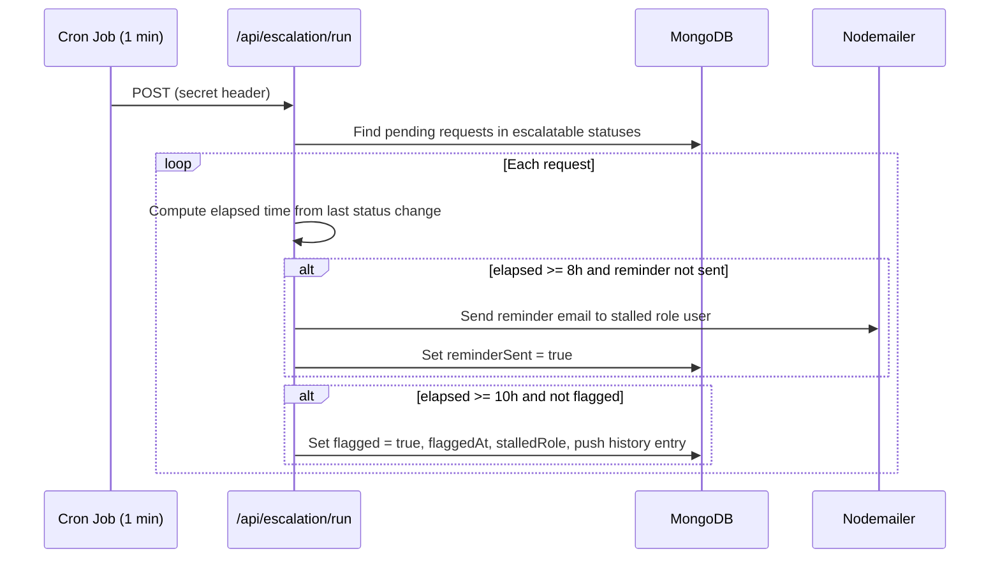
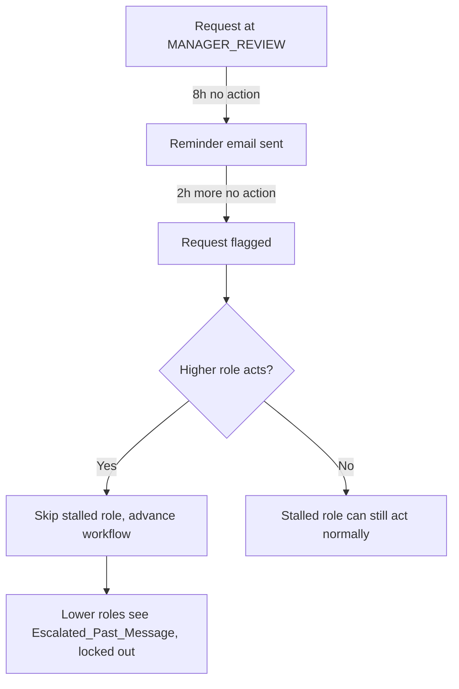

# Design Document: Approval Escalation & Flagging

## Overview

This feature adds an automatic escalation and flagging mechanism to the existing approval workflow. When a request stalls at any primary approval role for 8 hours, a reminder email is sent. At 10 hours, the request is automatically flagged, making it visible and actionable by higher roles in the hierarchy. The design integrates with the existing MongoDB-backed Next.js app, the `approvalEngine`, and the `filterRequestsByVisibility` pattern.

The workflow hierarchy for escalation purposes is:
`Institution_Manager → VP → HOI → Dean → Chief_Director → Chairman`

Intermediary roles (Accountant, MMA, HR, Audit, IT) are excluded from escalation logic.

## Architecture

The system has three main new components:

1. **Escalation Service** — a Next.js API route (`/api/escalation/run`) that performs the polling logic. It is invoked by an external cron job (e.g., Vercel Cron, GitHub Actions, or a system cron) at a 1-minute interval.
2. **Flagged Requests API** — a new endpoint (`/api/requests/flagged`) that returns flagged requests filtered by the authenticated user's role in the hierarchy.
3. **Flagged Requests UI** — a new page (`/dashboard/flagged`) with a sidebar nav entry (badge count) visible to VP, HOI, Dean, Chief Director, and Chairman.





## Components and Interfaces

### 1. Escalation Service (`/api/escalation/run`)

A `POST` route protected by a shared secret (`ESCALATION_SECRET` env var checked via `x-escalation-secret` header). On each invocation:

1. Query MongoDB for all requests whose `status` is in the escalatable set.
2. For each request, determine the reference timestamp: the `timestamp` of the most recent history entry that set the current status.
3. Compute `elapsedMs = now - referenceTimestamp`.
4. If `elapsedMs >= 8h` and `escalation.reminderSent === false`: send reminder email, set `escalation.reminderSent = true`.
5. If `elapsedMs >= 10h` and `escalation.flagged === false`: set `escalation.flagged = true`, `escalation.flaggedAt = now`, `escalation.stalledRole = currentRequiredRole`, push a history entry with `action: 'escalation_flagged'`.

**Escalatable statuses:**
```
MANAGER_REVIEW, VP_APPROVAL, HOI_APPROVAL, DEAN_REVIEW,
CHIEF_DIRECTOR_APPROVAL, CHAIRMAN_APPROVAL
```

**Role-to-user lookup:** The service queries the `User` collection for a user whose `role` matches the required approver role. For institutional roles (INSTITUTION_MANAGER, VP, HOI), it also matches `college` to the request's `college`.

### 2. Flagged Requests API (`/api/requests/flagged`)

A `GET` route that returns requests where `escalation.flagged === true` and `status` is not `APPROVED` or `REJECTED`. Results are filtered by the authenticated user's position in the hierarchy:

- A user at role R sees all flagged requests where `stalledRole` is R or any role below R in the hierarchy.
- Institution_Manager is excluded from this endpoint (403).

Response shape per request:
```typescript
{
  _id: string;
  requestId: string;
  title: string;
  college: string;
  department: string;
  requester: { name: string; email: string };
  status: RequestStatus;
  escalation: {
    flagged: boolean;
    flaggedAt: Date;
    stalledRole: UserRole;
    reminderSent: boolean;
    actedByHigherRole?: UserRole;
    actedByHigherRoleAt?: Date;
  };
  timeSinceFlagged: number; // ms
}
```

### 3. Flagged Request Action Endpoint (`/api/requests/[id]/approve`)

The existing approve route is extended to handle flagged requests. When a request has `escalation.flagged === true`:

- The acting user's role is validated against the hierarchy: they must be strictly higher than `stalledRole`.
- The permitted actions are determined by `getActionsForHigherRole(actingRole, stalledRole)` (new helper).
- On success: `escalation.actedByHigherRole` and `escalation.actedByHigherRoleAt` are set; the history entry includes `skippedRole: stalledRole`.
- The status transition uses the existing `approvalEngine.getNextStatus` with the acting role, as if the request had arrived at their step normally.

### 4. Flagged Requests Page (`/dashboard/flagged`)

A new client-side page that:
- Fetches from `/api/requests/flagged`.
- Displays a table with: request title, stalled role, time since flagging, requester name, college, department.
- For each request, shows available actions (if the user is a higher role and no higher role has acted yet).
- Shows the `Escalated_Past_Message` inline for requests where `actedByHigherRole` is set.

### 5. Sidebar Navigation Update (`app/dashboard/layout.tsx`)

A new nav item is added:
```typescript
{
  name: 'Flagged Requests',
  href: '/dashboard/flagged',
  icon: FlagIcon,
  roles: [UserRole.VP, UserRole.HEAD_OF_INSTITUTION, UserRole.DEAN, UserRole.CHIEF_DIRECTOR, UserRole.CHAIRMAN]
}
```

The badge count is fetched from `/api/requests/flagged?countOnly=true` and displayed similarly to the existing `queryCount` badge.

### 6. Request Detail Page Update (`/dashboard/requests/[id]`)

- If `escalation.flagged === true` and the viewer is the stalled role: show a yellow "Flagged" banner.
- If `escalation.actedByHigherRole` is set and the viewer is at or below the stalled role: show the `Escalated_Past_Message` and disable all action buttons.

## Data Models

### Request Schema Changes (`models/Request.ts`)

Add an `escalation` subdocument to the request schema:

```typescript
const escalationSchema = new mongoose.Schema({
  reminderSent: { type: Boolean, default: false },
  reminderSentAt: { type: Date },
  flagged: { type: Boolean, default: false },
  flaggedAt: { type: Date },
  stalledRole: { type: String }, // UserRole of the role that stalled
  actedByHigherRole: { type: String }, // UserRole of the higher role that acted
  actedByHigherRoleAt: { type: Date },
}, { _id: false });
```

Add to `requestSchema`:
```typescript
escalation: { type: escalationSchema, default: () => ({}) }
```

### Approval History Entry Extensions

New `ActionType` values to add to `lib/types.ts`:
```typescript
ESCALATION_REMINDER = 'escalation_reminder',  // logged when reminder email sent
ESCALATION_FLAGGED = 'escalation_flagged',     // logged when request is flagged
ESCALATION_ACTION = 'escalation_action',       // logged when higher role acts on flagged request
```

History entry fields for `ESCALATION_ACTION`:
```typescript
skippedRole: { type: String }  // the stalledRole that was bypassed
```

### Workflow Hierarchy Constant (`lib/escalation-hierarchy.ts`)

New file defining the ordered escalation hierarchy and helper functions:

```typescript
export const ESCALATION_HIERARCHY: UserRole[] = [
  UserRole.INSTITUTION_MANAGER,
  UserRole.VP,
  UserRole.HEAD_OF_INSTITUTION,
  UserRole.DEAN,
  UserRole.CHIEF_DIRECTOR,
  UserRole.CHAIRMAN,
];

// Returns true if roleA is strictly higher than roleB in the hierarchy
export function isHigherRole(roleA: UserRole, roleB: UserRole): boolean

// Returns all roles strictly higher than the given role
export function getHigherRoles(role: UserRole): UserRole[]

// Returns the set of actions a higherRole can take on a request stalled at stalledRole
export function getActionsForHigherRole(
  actingRole: UserRole,
  stalledRole: UserRole,
  request: any
): string[]

// Returns the escalatable statuses
export const ESCALATABLE_STATUSES: RequestStatus[]

// Returns the reference timestamp for escalation (timestamp of last status-setting history entry)
export function getEscalationReferenceTime(request: any): Date | null
```

### Email Template

New function in `lib/email.ts`:
```typescript
export async function sendEscalationReminderEmail(
  toEmail: string,
  toName: string,
  requestTitle: string,
  requestId: string,
  elapsedHours: number,
  stalledRole: string
): Promise<boolean>
```

The email body includes: request title, elapsed time, stalled role, and a warning that the request will be flagged in `(10 - elapsedHours)` hours.

## Correctness Properties

*A property is a characteristic or behavior that should hold true across all valid executions of a system — essentially, a formal statement about what the system should do. Properties serve as the bridge between human-readable specifications and machine-verifiable correctness guarantees.*

### Property 1: Reminder triggers only at the 8-hour threshold

*For any* pending request in an escalatable status, the escalation service should send a reminder email if and only if the elapsed time since the last status-setting history entry is at least 8 hours AND `escalation.reminderSent` is false.

**Validates: Requirements 1.1, 1.4**

---

### Property 2: Reminder email contains required fields

*For any* request, calling the reminder email template function with that request's data should produce an output string that contains the request title, the elapsed time, and the 2-hour warning message.

**Validates: Requirements 1.2**

---

### Property 3: Flagging triggers only at the 10-hour threshold

*For any* pending request in an escalatable status, the escalation service should set `escalation.flagged = true` if and only if the elapsed time since the last status-setting history entry is at least 10 hours AND `escalation.flagged` is false.

**Validates: Requirements 2.1, 2.3**

---

### Property 4: Flagging records a complete history entry

*For any* request that gets flagged, the resulting history array should contain an entry with `action = 'escalation_flagged'`, a non-null `stalledRole`, a non-null `timestamp`, and a reason field indicating timeout.

**Validates: Requirements 2.2**

---

### Property 5: Escalation only applies to escalatable statuses

*For any* request whose status is NOT in `[MANAGER_REVIEW, VP_APPROVAL, HOI_APPROVAL, DEAN_REVIEW, CHIEF_DIRECTOR_APPROVAL, CHAIRMAN_APPROVAL]`, the escalation service should neither send a reminder email nor set `escalation.flagged = true`, regardless of elapsed time.

**Validates: Requirements 7.1, 7.2, 7.3**

---

### Property 6: Flagged request visibility follows hierarchy

*For any* flagged request with a given `stalledRole`, calling the flagged-requests filter with a user role R should return that request if and only if R is equal to `stalledRole` OR R is strictly higher than `stalledRole` in `ESCALATION_HIERARCHY`.

**Validates: Requirements 3.1, 3.3**

---

### Property 7: Flagged requests API response contains all required display fields

*For any* flagged request returned by `/api/requests/flagged`, the response object should contain: `title`, `escalation.stalledRole`, `escalation.flaggedAt`, `requester.name`, `college`, and `department`.

**Validates: Requirements 3.7**

---

### Property 8: Resolved requests are excluded from flagged view

*For any* request with `status = APPROVED` or `status = REJECTED`, the flagged requests filter should not include that request in its output, regardless of the value of `escalation.flagged`.

**Validates: Requirements 3.8**

---

### Property 9: Higher role lockout after escalation action

*For any* flagged request where `escalation.actedByHigherRole` is set to role R, any user whose role is at or below R in `ESCALATION_HIERARCHY` (including the stalled role) should be denied action on that request, and the response should include the `Escalated_Past_Message`.

**Validates: Requirements 3.5, 3.6**

---

### Property 10: Higher role action produces correct next status

*For any* flagged request stalled at role S, when a higher role R acts on it with a permitted action, the resulting `status` should equal `approvalEngine.getNextStatus(currentStatus, action, R, context)` — the same transition that would occur if R were acting on a non-flagged request at their normal step.

**Validates: Requirements 4.1, 4.2, 4.4, 4.5, 4.6, 4.7, 4.8**

---

### Property 11: Escalation action history records skipped role

*For any* flagged request where a higher role R acts, the new history entry should have `action = 'escalation_action'` and `skippedRole` equal to `escalation.stalledRole`.

**Validates: Requirements 4.3**

---

### Property 12: Invalid higher-role actions are rejected without state change

*For any* flagged request, if a user attempts an action that is not in `getActionsForHigherRole(actingRole, stalledRole, request)`, the API should return an error status and the request's `status` and `escalation` fields should remain unchanged.

**Validates: Requirements 4.9**

---

### Property 13: Escalation timer reference is the last status-setting history timestamp

*For any* request, `getEscalationReferenceTime(request)` should return the `timestamp` of the most recent history entry whose `newStatus` equals the request's current `status`.

**Validates: Requirements 6.1, 6.3**

---

### Property 14: Badge count equals number of actionable flagged requests for the user's role

*For any* authenticated user with role R, the badge count returned by `/api/requests/flagged?countOnly=true` should equal the number of flagged requests where R can see the request (per Property 6) AND `escalation.actedByHigherRole` is not set AND `status` is not APPROVED or REJECTED.

**Validates: Requirements 5.2**

## Error Handling

### Escalation Service Failures

- If the reminder email fails to send, the service logs the failure with `requestId`, `stalledRole`, and `timestamp`, and does NOT set `reminderSent = true` so the next poll will retry.
- If the MongoDB update for flagging fails, the service logs the error and continues processing other requests (fail-open per request, not per batch).
- The cron endpoint returns a 200 with a summary payload `{ processed: N, reminded: N, flagged: N, errors: [] }` so the cron runner can log outcomes.

### Flagged Requests API

- Institution_Manager attempting to access `/api/requests/flagged` receives `403 Forbidden`.
- Unauthenticated requests receive `401 Unauthorized`.
- If no flagged requests exist for the user's role, returns `{ requests: [], count: 0 }` (not 404).

### Higher Role Action Validation

- If the acting user is not strictly higher than `stalledRole`, returns `403` with message `"Not authorized to act on this flagged request"`.
- If the action is not in the permitted set for the acting role, returns `400` with message `"Action not permitted for your role on this flagged request"`.
- If the request is not flagged, the normal approval flow applies (no special escalation handling).

### Stalled Role User Not Found

- If no user with the required role (and matching college for institutional roles) is found in the User collection, the escalation service logs a warning and skips sending the reminder email for that request. Flagging still proceeds.

## Testing Strategy

### Unit Tests

Focus on specific examples and edge cases:

- Reminder email template renders correctly with known inputs.
- `isHigherRole(UserRole.DEAN, UserRole.VP)` returns `true`; `isHigherRole(UserRole.VP, UserRole.DEAN)` returns `false`.
- `getEscalationReferenceTime` returns the correct timestamp for a request with multiple history entries.
- `getActionsForHigherRole` returns the correct action set for each valid higher-role/stalled-role combination.
- Institution_Manager is denied access to `/api/requests/flagged`.
- A request with `status = APPROVED` is excluded from flagged results even if `escalation.flagged = true`.
- The `Escalated_Past_Message` is returned for a stalled role after a higher role has acted.

### Property-Based Tests

Use a property-based testing library (e.g., **fast-check** for TypeScript) with a minimum of 100 iterations per property.

Each test is tagged with: `Feature: approval-escalation-flagging, Property N: <property_text>`

- **Property 1** — Generate random requests with varying elapsed times and `reminderSent` states; verify reminder triggers iff elapsed >= 8h and reminderSent is false.
  `// Feature: approval-escalation-flagging, Property 1: Reminder triggers only at the 8-hour threshold`

- **Property 2** — Generate random request titles, elapsed hours, and role strings; verify the email template output contains all three.
  `// Feature: approval-escalation-flagging, Property 2: Reminder email contains required fields`

- **Property 3** — Generate random requests with varying elapsed times and `flagged` states; verify flagging triggers iff elapsed >= 10h and flagged is false.
  `// Feature: approval-escalation-flagging, Property 3: Flagging triggers only at the 10-hour threshold`

- **Property 4** — Generate random requests, run the flagging function, verify the history entry shape.
  `// Feature: approval-escalation-flagging, Property 4: Flagging records a complete history entry`

- **Property 5** — Generate random requests with non-escalatable statuses and any elapsed time; verify no reminder or flagging occurs.
  `// Feature: approval-escalation-flagging, Property 5: Escalation only applies to escalatable statuses`

- **Property 6** — Generate random flagged requests with random `stalledRole` values; for each role in the hierarchy, verify visibility matches the hierarchy predicate.
  `// Feature: approval-escalation-flagging, Property 6: Flagged request visibility follows hierarchy`

- **Property 7** — Generate random flagged requests; verify the API response shape contains all required display fields.
  `// Feature: approval-escalation-flagging, Property 7: Flagged requests API response contains all required display fields`

- **Property 8** — Generate random requests with APPROVED or REJECTED status and `escalation.flagged = true`; verify they are excluded from flagged results.
  `// Feature: approval-escalation-flagging, Property 8: Resolved requests are excluded from flagged view`

- **Property 9** — Generate random flagged requests with `actedByHigherRole` set; for all roles at or below the acting role, verify action is denied and message is present.
  `// Feature: approval-escalation-flagging, Property 9: Higher role lockout after escalation action`

- **Property 10** — Generate random flagged requests and valid higher-role/action combinations; verify the resulting status matches `approvalEngine.getNextStatus` output.
  `// Feature: approval-escalation-flagging, Property 10: Higher role action produces correct next status`

- **Property 11** — Generate random flagged requests and higher-role actions; verify the history entry contains `action = 'escalation_action'` and `skippedRole = stalledRole`.
  `// Feature: approval-escalation-flagging, Property 11: Escalation action history records skipped role`

- **Property 12** — Generate random flagged requests and invalid action strings for the acting role; verify the API returns an error and the request is unchanged.
  `// Feature: approval-escalation-flagging, Property 12: Invalid higher-role actions are rejected without state change`

- **Property 13** — Generate random request history arrays with multiple status-setting entries; verify `getEscalationReferenceTime` returns the timestamp of the most recent one matching current status.
  `// Feature: approval-escalation-flagging, Property 13: Escalation timer reference is the last status-setting history timestamp`

- **Property 14** — Generate random sets of flagged requests and a user role; verify the badge count equals the count of actionable flagged requests visible to that role.
  `// Feature: approval-escalation-flagging, Property 14: Badge count equals number of actionable flagged requests for the user's role`
